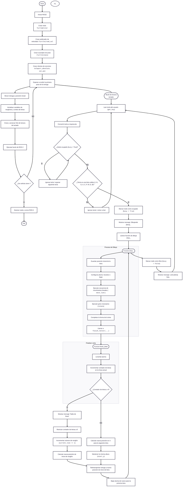

<p align="center">
  
</p>

<!-- ✦✦✦ FUTURE IS AUTOMATED ✦✦✦ -->
<!-- Banner superior "neón" -->
<p align="center">
  
</p>

<h1 align="center">🤖 LABORATORIO 4 – INTRODUCCIÓN A ROS 2 HUMBLE - TURTLESIM</h1>

## Laboratorio 4: Introducción a ROS 2 y Turtlesim


<center>
<div style="text-align: center;">
  
</div>
</center>


## Objetivos
- **Control manual** de la tortuga usando el teclado.
- **Dibujo automático** de letras personalizadas con el simulador Turtlesim.
- **Familiarización con los conceptos fundamentales de ROS 2**: nodos, tópicos, y servicios.

## Procedimiento

### 1. Instalación y configuración
1. **Lanzar el simulador de Turtlesim**:
   ```bash
   source /opt/ros/humble/setup.bash
   ros2 run turtlesim turtlesim_node
   ```
2. **Compilar y ejecutar el código Python**:
   ```bash
   source /opt/ros/humble/setup.bash
   cd ~/ros2_ws
   colcon build
   source install/setup.bash
   ros2 run my_turtle_controller move_turtle
   ```

### 2. Control manual

El control manual de la tortuga se realiza utilizando las **flechas del teclado**:
- Flecha **↑**: avanzar.
- Flecha **↓**: retroceder.
- Flecha **←**: girar a la izquierda.
- Flecha **→**: girar a la derecha.

### 3. Dibujo automático de letras


La tortuga dibuja las letras de las iniciales del equipo utilizando teclas específicas:
- **Tecla M**: dibuja la letra "M".
- **Tecla F**: dibuja la letra "F".
- **Tecla C**: dibuja la letra "C".

Además, las secuencias de palabras pueden ser dibujadas con las teclas:
- **'1'**: dibuja la secuencia **SABP**.
- **'2'**: dibuja la secuencia **SFRM**.
- **'3'**: dibuja **SABP + SFRM**.

### 4. Estructura del código

El código se encuentra organizado en varias funciones, donde cada una es responsable de tareas específicas:
- **move_turtle2.py**: Nodo principal que maneja el control de la tortuga y las secuencias de letras.
- **Funciones de movimiento**: `move_timed`, `rotate_to_angle`, y `go_to_point` permiten controlar el movimiento y la orientación de la tortuga con precisión.
- **Dibujo de letras**: Se implementan funciones para dibujar las letras de forma continua (`draw_S_continuous`, etc.).

### 5. Diagrama de flujo

El diagrama de flujo a continuación resume el funcionamiento principal del nodo:



### 6. Código fuente

Se adjunta el código principal del laboratorio:
- **move_turtle2.py**: Nodo para controlar el movimiento de la tortuga y manejar las funciones de dibujo.
- **Funciones de dibujo**: Dibujar letras como `draw_S_continuous()`, `draw_A_continuous()`, etc.
- **Funciones de movimiento**: `move_timed()`, `go_to_point()`, y `rotate_to_angle()`.

### Secciones / bloques de codigo

#### 1. Encabezado e importaciones.
```python
import rclpy
from rclpy.node import Node
from geometry_msgs.msg import Twist
from turtlesim.msg import Pose
from turtlesim.srv import TeleportAbsolute, SetPen
import sys, tty, termios, threading, math, time
```
- Crear y ejecutar un nodo ROS2 (rclpy, Node).

- Enviar velocidades a la tortuga (Twist).

- Recibir su posición actual (Pose).

- Usar servicios del simulador, como teletransportar y cambiar el lápiz (TeleportAbsolute, SetPen).

- Leer teclas directamente desde la terminal sin presionar Enter.

- Manejar hilos, matemáticas y tiempos.
  
#### 2.Lectura de teclas en modo "raw"
```python
def get_key():
    fd = sys.stdin.fileno()
    old_settings = termios.tcgetattr(fd)
    try:
        tty.setraw(fd)
        key = sys.stdin.read(1)
    finally:
        termios.tcsetattr(fd, termios.TCSADRAIN, old_settings)
    return key

```

El programa incluye una función que lee una tecla del teclado al instante, sin usar Enter.
Esto permite controlar la tortuga en tiempo real. La función cambia temporalmente la configuración del teclado a modo “raw” y luego la restaura.

#### 3. Clase del nodo principal
```python
class TurtleWriter(Node):
    def __init__(self):
        super().__init__('turtle_writer_pro')
        ...

```
La clase TurtleWriter es el núcleo del programa.
Hereda de Node y define toda la lógica para mover la tortuga, dibujar letras y organizar el texto en la pantalla.
```python
# Publicador y Suscriptor
self.vel_pub = self.create_publisher(Twist, '/turtle1/cmd_vel', 10)
self.pose_sub = self.create_subscription(Pose, '/turtle1/pose', self.pose_callback, 10)

# Clientes
self.teleport_client = self.create_client(TeleportAbsolute, '/turtle1/teleport_absolute')
self.pen_client = self.create_client(SetPen, '/turtle1/set_pen')

self.pose = None
self.busy = False 
self.spacing = 0.5  # Espacio entre letras

# VARIABLES PARA EL MANEJO DE RENGLONES
self.origin_x = 1.0       # Margen izquierdo
self.base_y = 9.0         # Altura del primer renglón (Arriba)
self.line_height = 3.5    # Espacio vertical entre renglones

self.letters_count = 0    # Cuántas letras llevamos en la línea actual
self.current_line = 0     # En qué renglón estamos (0, 1, 2...)

# Esperar conexión
self.get_logger().info("Esperando a Turtlesim...")
while self.pose is None and rclpy.ok():
    rclpy.spin_once(self, timeout_sec=0.1)

# MOVER AL INICIO (ESQUINA SUPERIOR IZQUIERDA)
self.initialize_position()

# Hilo del teclado
self.thread = threading.Thread(target=self.key_loop)
self.thread.daemon = True
self.thread.start()

```

En su constructor (__init__) se realizan varias tareas:
a.  Creación del publicador y suscriptor
- Se crea un publicador para enviar velocidades a la tortuga.
- Se crea un suscriptor para obtener la pose actual de la tortuga en todo momento.
b. Creación de clientes de servicio
- Teletransporte absoluto (para mover la tortuga a coordenadas exactas).
- Control del lápiz (para activar/desactivar el dibujo).
c. Inicialización de parámetros de escritura
Se definen las variables que controlan:
- El espacio entre letras.

- La posición inicial de escritura (arriba a la izquierda).

- El alto entre renglones.

- Cuántas letras van escritas en la línea actual.

- En qué renglón se encuentra la tortuga.

d. Espera de la primera pose
El programa espera hasta recibir la primera actualización de posición, asegurándose de que turtlesim está activo antes de continuar.

e. Posicionamiento inicial
Una vez todo está listo, la tortuga es teletransportada a la esquina superior izquierda sin dibujar, indicando el comienzo del área de escritura.

f. Hilo independiente para leer el teclado
La lectura de teclas se ejecuta en un hilo separado, de modo que el nodo puede seguir funcionando mientras el usuario presiona teclas.

#### 4. Actualización continua de la pose
```python
def pose_callback(self, msg):
    self.pose = msg

```

Existe un callback que guarda la pose de la tortuga cada vez que llega un mensaje nuevo.
Gracias a esto, las funciones de movimiento siempre saben la posición y orientación reales.
#### 5. Funciones de utilidad

El programa contiene varias funciones auxiliares importantes:
```python
def initialize_position(self):
    """Lleva la tortuga a la posición inicial (arriba izquierda) sin pintar."""
    self.set_pen(True)
    self.teleport_abs(self.origin_x, self.base_y, 0.0)
    self.set_pen(False)
    self.get_logger().info("Posición inicial establecida en esquina superior izquierda.")
```
a. Posición inicial de escritura
Apaga el lápiz, mueve la tortuga al margen superior izquierdo y vuelve a activar el lápiz.
```python
def stop(self):
    self.vel_pub.publish(Twist())
```
b. Detener movimiento
Publica un mensaje vacío de velocidad para parar inmediatamente a la tortuga.
```python
def teleport_abs(self, x, y, theta):
    req = TeleportAbsolute.Request()
    req.x = float(x)
    req.y = float(y)
    req.theta = float(theta)
    self.teleport_client.call_async(req)
    time.sleep(0.05)

```
c. Teletransporte absoluto
Envía una solicitud al servicio para mover a la tortuga a una posición X-Y definida y con un ángulo exacto.
```python
def set_pen(self, off=False):
    req = SetPen.Request()
    req.r, req.g, req.b = 255, 255, 255
    req.width = 3
    req.off = 1 if off else 0
    self.pen_client.call_async(req)
    time.sleep(0.2)
```
d. Control del lápiz
Permite activar o desactivar el lápiz para trazar o moverse sin dejar rastro.

#### 6. Gestión del salto de línea
```python
def finish_letter(self, start_x, start_y, letter_width):
    """
    Lógica inteligente:
    1. Cuenta la letra terminada.
    2. Si llegamos a 4, salta de línea y resetea X.
    3. Si no, simplemente se mueve a la derecha.
    """
    self.set_pen(True) 
    self.letters_count += 1
    
    # VERIFICAR SI TOCA CAMBIO DE LINEA (4 letras por línea)
    if self.letters_count >= 4:
        ...
        # Calcula nueva X,Y para el siguiente renglón
        ...
    else:
        # Comportamiento normal: Mover a la derecha
        new_x = start_x + letter_width + self.spacing
        self.teleport_abs(new_x, start_y, 0.0)

    self.set_pen(False)

```

Después de dibujar cada letra, el programa ejecuta una función que:

- Aumenta el conteo de letras en la línea actual.
- Si ya se han escrito 4 letras, baja un renglón y reinicia la posición horizontal.
- Si aún no se ha completado la línea, simplemente mueve la tortuga hacia la derecha dejando espacio para la siguiente letra.
- Si se alcanzara el borde inferior de la pantalla, reinicia y vuelve al renglón superior.

  Esta lógica automatiza completamente la organización del “texto” en turtlesim.
#### 7. Movimientos controlados: líneas rectas y rotaciones
```python
def move_line(self, distance, tolerance=0.1, speed_factor=2.0):
    ...
    # Calcula punto objetivo y distancia restante
    # Ajusta la velocidad según lo lejos que está del objetivo
    # Avanza o retrocede hasta estar dentro de la tolerancia
    ...
    self.stop()
    self.teleport_abs(target_x, target_y, self.pose.theta)

```

a. Movimiento en línea recta

La tortuga avanza una distancia específica, ajustando la velocidad según qué tan lejos está del objetivo.
Al terminar, se corrige su posición con un teletransporte para evitar errores acumulados.
```python
def rotate(self, relative_angle, tolerance=0.05):
    ...
    # Calcula el ángulo objetivo sumando el ángulo relativo
    # Gira hasta que el error angular sea menor que la tolerancia
    ...
    self.stop()
    self.teleport_abs(self.pose.x, self.pose.y, target_angle)
```
b. Rotación controlada

El programa hace girar la tortuga un ángulo relativo, ajustando la velocidad angular según el error restante, y luego corrige el ángulo final para asegurar precisión.

Estas funciones permiten que las letras tengan un tamaño y forma consistentes.
#### 8. Métodos para dibujar cada letra
```python
def draw_J(self):
    start_x = self.pose.x
    start_y = self.pose.y 
    h, w = 2.0, 1.0

    # J empieza arriba
    self.set_pen(True)
    self.teleport_abs(start_x, start_y + h, 0.0)
    self.set_pen(False)
    
    self.move_line(w) 
    self.move_line(-w/2) 
    self.rotate(-math.pi/2) 
    self.move_line(h) 
    self.rotate(-math.pi/4) 
    self.move_line(0.5)
    
    self.finish_letter(start_x, start_y, w)

```

Cada letra del alfabeto (J, N, G, A, C, P, M, E, B) tiene un método dedicado que:

- Calcula la posición base.

- Ajusta el lápiz según sea necesario.

- Traza líneas rectas y curvas combinando movimientos y rotaciones.

- Mantiene proporciones similares entre letras.

- Llama al sistema de salto de línea para preparar la siguiente posición.

- Cada letra es un “macro de dibujo” creado específicamente para reproducirse siempre con la misma forma.
#### 9. Bucle de interacción por teclado
```python
def key_loop(self):
    print("\n--- SISTEMA LISTO ---")
    print(f"Inicio: ({self.origin_x}, {self.base_y})")
    print("Modo automático: 4 letras por línea, 3 líneas.")
    print("Presiona: J, N, G, A, C, P, M, E, B")
    print("Presiona: 'Q' para salir.\n")
    
    while rclpy.ok():
        k = get_key().upper()
        if k == 'Q':
            rclpy.shutdown()
            break
        
        if not self.busy and k in ['J', 'N', 'G', 'A', 'C', 'P', 'M', 'E', 'B']:
            self.busy = True
            self.get_logger().info(f"Dibujando {k}...")
            
            if k == 'J': self.draw_J()
            elif k == 'N': self.draw_N()
            ...
            
            self.busy = False
            self.get_logger().info(f"Letra {k} lista.")

```

El programa muestra instrucciones en la terminal y entra en un ciclo que:

- Espera a que el usuario presione una tecla.

- Si se presiona Q, el programa termina.

- Si se presiona una letra válida, se dibuja la figura correspondiente.

- Se evita que se dibujen letras simultáneamente usando un indicador de ocupación (busy).

Esta es la interfaz principal del usuario.
#### 10. Función principal
```python
def main(args=None):
    rclpy.init(args=args)
    node = TurtleWriter()
    try:
        rclpy.spin(node)
    except KeyboardInterrupt:
        pass
    finally:
        node.destroy_node()
        if rclpy.ok():
            rclpy.shutdown()

if __name__ == '__main__':
    main()

```

La función main():

1. Inicializa ROS2.

2. Crea una instancia del nodo TurtleWriter.

3. Ejecuta el nodo indefinidamente mientras procesa eventos.

4. Permite una salida segura al presionar Ctrl+C.

5. Cierra ROS2 limpiamente al finalizar.

### 7. Video Explicativo


A continuación, se presenta un video donde se explica el proceso de ejecución y la demostración del funcionamiento del laboratorio:

[](https://youtu.be/ppMkalenVMg)

## Conclusiones
- Se logró controlar completamente la tortuga utilizando ROS 2, sin usar `turtle_teleop_key`.
- Se implementó un sistema de dibujo de letras continuas, respetando los tamaños y espaciados consistentes.
- El uso de ROS 2 y los servicios como `/reset` permitió realizar una simulación precisa de las letras.

---
